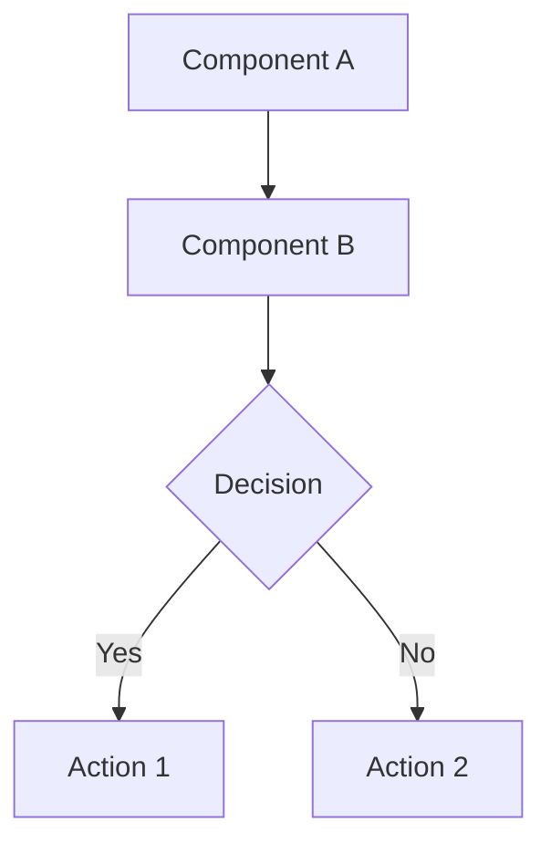

# Documentation File Types

Templates and rules for each documentation type. All files use Obsidian markdown with tags, wiki links, and Mermaid diagrams where appropriate.

---

## Bugs

**Location:** `documentation/Bugs/[status]/[Bug-Name].md`
**Lifecycle:** `to-do` → `in-progress` → `done`

### Required Tags

Bug type (pick one): `#optimization` `#architectural` `#performance` `#security` `#reliability` `#usability`
Importance (pick one): `#low` `#medium` `#high` `#critical`

### Template

```markdown
#critical #reliability

### 🔴 CRITICAL: [Bug Title]

## Problem Explanation

[Detailed description of the bug and why it matters]

### Real-World Scenarios
[Concrete examples of when this bug manifests]

### Impact
- [Impact item 1]
- [Impact item 2]

### Affected Files
- [[RelatedCodeExplanation-ext]] — [how it's affected]
- `src/path/to/File.ext:123` — [specific location]

### Affected Processes
- [[RelatedProcessDoc]] — [how it's affected]

---

## Solution Architecture

### Core Components
[High-level description of the solution approach and why it's appropriate]

### Pros
- [Pro 1]

### Cons
- [Con 1]

---

## Implementation Plan

### Phase 1: [Phase Name]
- [ ] **Step 1.1:** [Description]
- [ ] **Step 1.2:** [Description]

### Phase 2: [Phase Name]
- [ ] **Step 2.1:** [Description]
  - [ ] **→ See Task:** [[Bug-Name-step-2-1-short-description]]

---

## Files to Modify or Create
- `src/path/to/File.ext` — [what changes]

---

## Benefits
- [Benefit 1]
```

### Link Requirements
- Link to `Code/` files with Obsidian wiki links: `[[FileName-ext]]`
- Link to `Docs/` files for affected processes: `[[ProcessName]]`
- Reference source code as plain text paths: `src/path/to/File.ext:123`

---

## Features

**Location:** `documentation/Features/[status]/[Feature-Name].md`
**Lifecycle:** `to-do` → `in-progress` → `done`

### Required Tags

Feature type (pick one): `#new-feature` `#enhancement` `#integration` `#refactor`
Importance (pick one): `#low` `#medium` `#high` `#critical`

### Template

```markdown
#high #new-feature

## Feature: [Feature Name]

### Description
[Complete description of the feature and what it enables]

### Scope
[Which workflows, processes, or systems are impacted]

### Affected Systems / Modules
- [[System-Architecture-Doc]] — [how it's affected]
- [[Module-Explanation-File]] — [what changes]

### Impact Analysis
[How this affects existing functionality, performance, or behavior]

### Risk Assessment
[Possible side effects, breaking changes, or things to watch out for]

---

## Implementation Architecture

### Changes Required

#### 1. [Component/Module/File Name]
**Purpose:** [Why we're creating/modifying this]
**Changes:** [Detailed technical changes]
**Links:** [[Code-Explanation-File]]

---

## Implementation Steps

### Phase 1: [Phase Name]
- [ ] **Step 1.1:** [Technical task description]
- [ ] **Step 1.2:** [Technical task description]
  - [ ] **→ See Task:** [[Feature-Name-step-1-2-short-description]]

---

## Potential Issues / Risks
- [Edge case or integration risk]
```

### Link Requirements
- Link to `Code/` and `Docs/` files using wiki links
- Reference source files as plain text: `src/path/to/file.ext:42`
- Use full URLs for external API documentation

---

## Tasks

**Location:** `documentation/Tasks/[status]/[Task-Name].md`
**Lifecycle:** `current` → `done`

### Naming Convention
`[ParentName]-step-[N]-[short-description].md`

Examples:
- `Implement-Idempotency-step-2-1-IdempotencyManager.md`
- `OAuth2-Login-step-1-2-Configure-Dependencies.md`

### Required Tags
- `#task` — always present
- `#current` or `#done` — matches the directory
- Complexity: `#low-complexity` `#medium-complexity` `#high-complexity`
- Parent reference (kebab-case of parent): `#parent-idempotency`, `#parent-oauth2-login`

**Example:** `#task #current #high-complexity #parent-idempotency`

### Scope Rule

A task file documents ONLY the specific implementation step it addresses. It should not include implementation details for other steps — just brief forward/backward references for context.

### Template

```markdown
# Task: [Descriptive Name]

#task #current #medium-complexity #parent-[parent-name]

**Parent:** [[ParentBugOrFeatureName]]
**Related Step:** Phase 2, Step 2.1
**Estimated Complexity:** Medium

---

## Goal

[1-2 sentences: what this task accomplishes and why it's needed]

---

## Context from Parent

[Brief summary of what the parent says about this step — key requirements, constraints, architectural decisions]

---

## Implementation Details

### Approach

[Strategy, design pattern, component interactions, key decisions]

### Files to Create/Modify

- [ ] `src/path/to/File.ext` — [[File-ext]] — purpose in this task

---

## Step-by-Step Implementation

### Step 1: [Title]

- [ ] **Done**
  - [What this step accomplishes]
  - [Key implementation details]

**Why this step is critical:**
[Explanation of its role in the larger architecture]

#### Implementation

```[language]
// Code example with inline comments
```

#### Edge Cases
1. **Case:** [description] — [how it's handled]

---

## Design Decisions

**Decision 1:** [What was decided]
- **Why:** [Technical reasoning and trade-offs]
- **Alternatives considered:** [What else was evaluated and why it was rejected]

---

## Testing Considerations

**Basic Functionality:** [Core behaviors to verify]
**Edge Cases:** [Boundary conditions and error scenarios]
**Integration:** [How to test integration with other components]

---

## Related Code Explanations

- [[RelatedFile-ext]] — [specific relationship]
- `src/path/to/File.ext:line` — [relevant detail]

---

## Completion Criteria

- [ ] All files created/modified as specified
- [ ] All implementation steps checked off
- [ ] Code explanation files updated (if new files created)
- [ ] Parent bug/feature step marked complete
```

---

## Code Explanations

**Location:** `documentation/Code/[FileName-ext].md`

### Naming Convention
Replace dots in the filename with dashes:
- `AuthService.ts` → `AuthService-ts.md`
- `user_model.py` → `user_model-py.md`
- `application.properties` → `application-properties.md`

### Required Tags

Architectural role (pick one): `#entry-point` `#logic` `#persistence` `#data-access` `#interface` `#transport` `#utility` `#config`

Technical context (pick applicable): `#async` `#ui` `#security` `#integration`

### Template

```markdown
# [FileName].[ext]

#logic #security

## Purpose
[High-level summary of what this component does and its role in the system]

---

## Component Information

**Type:** [Class | Module | Function Collection | Interface | Configuration | Script]
**Namespace/Path:** [Full directory path or package]
**Dependencies:** [Key external libraries or internal modules]

---

## Data Structures & State

### [fieldName]
**Type:** [Data type]
**Purpose:** [What this represents]
**Attributes:** [e.g., private, readonly, @Validated]

---

## Logic & Interface

### [methodName()]
**Purpose:** [What this logic performs]
**Parameters:** [Names and types]
**Returns:** [Return type and description]
**Errors/Exceptions:** [What can go wrong]

**Implementation Detail:**
[Step-by-step logic flow]

**Diagram (if complex):**
```mermaid
sequenceDiagram
    [Diagram here]
```

---

## Relationships & Traceability

**Related Files:**
- [[OtherFile-ext]] — [relationship explanation]
- `src/path/to/source.ext:line` — [direct source reference]

**Dependencies:**
- This file depends on: [[DependencyFile-ext]]
- This file is used by: [[ConsumerFile-ext]]
```

### Handling Missing Linked Files
If a referenced file doesn't have an explanation yet, still create the link: `[[MissingFile-ext]]`. Then prompt the user: "I noticed `MissingFile.ext` doesn't have an explanation file. Would you like me to generate one?"

---

## System / Process Docs

**Location:** `documentation/Docs/[Process-Name].md`

These documents explain how systems and workflows work — not individual files. Focus on how multiple components work together.

### Template

```markdown
## Table of Contents
1. [Overview](#overview)
2. [Key Entities](#key-entities)
3. [Architecture](#architecture)
4. [Process Flow](#process-flow)
5. [Technical Implementation Details](#technical-implementation-details)
6. [Related Files](#related-files)

---

## Overview

[High-level explanation in plain language — avoid jargon]

### Core Concepts
[Key concepts explained simply]

---

## Key Entities

### 1. [EntityName]
[Description with link to code explanation: [[EntityName-ext]]]

---

## [System Name] Architecture

[Detailed architecture explanation]

### Diagram



---

## [Process Name] Flow

### Step 1: [Step Name]
**Location:** [[FileName-ext]] — `src/path/to/File.ext:42`
[What happens here]

---

## Technical Implementation Details
[Deep-dive into technical aspects that need explanation]

---

## Related Files

### Controllers
- [[ControllerFile-ext]] — [description]

### Services
- [[ServiceFile-ext]] — [description]

### Models / Entities
- [[ModelFile-ext]] — [description]
```

### Requirements
- Use Mermaid.js for all complex flows and interactions
- Link to all related `Code/` explanation files
- Reference source code as plain text paths with line numbers
- Don't describe how a single code file works — that belongs in `Code/`
- Focus on how the system works as a whole
