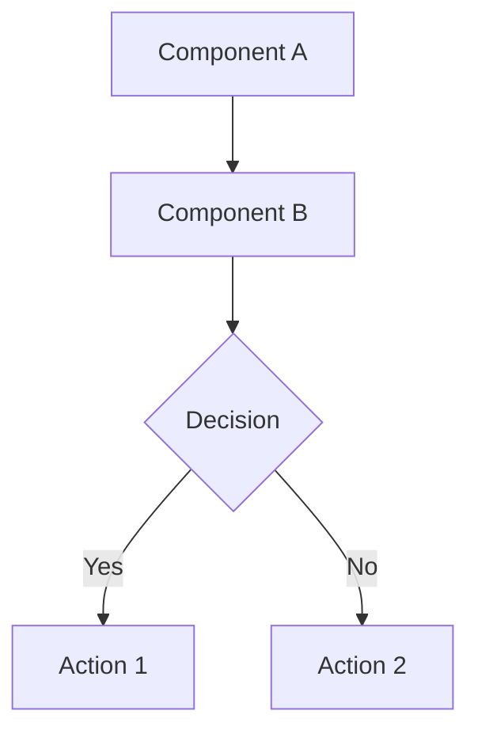

# Documentation File Types

Templates and rules for each documentation type. All files use Obsidian markdown with tags, wiki links, and Mermaid diagrams where appropriate.

---

## Bugs

**Location:** `documentation/Bugs/[status]/[Bug-Name].md`
**Lifecycle:** `to-do` → `in-progress` → `done`

### What This Document Is

A Bug Report documents the technical analysis of a defect and the roadmap to fix it. It is not the final technical implementation plan.

Use a Bug Report to explain the issue, its impact, the analysis findings, the suspected or confirmed cause, and the evidence that supports that conclusion. It should point to the exact code files and lines involved, explain why those parts of the code are responsible, and include supporting logs when logs help justify the diagnosis. If the cause is not fully confirmed, state that clearly and explain the current hypothesis and uncertainty.

Bug Reports are usually the result of codebase analysis. They should capture the reasoning behind the diagnosis, not only the visible symptom. They should also record how the bug is reproduced or observed, what evidence was reviewed during the investigation, what remains uncertain, and how the proposed solution will be validated. Use the relevant technology skills and up-to-date documentation from Context7 when available.

Like Features, Bug Reports should include ordered non-blocking steps to resolve the issue and a final task breakdown that groups those steps by order and complexity. Bug Reports are created before task documents exist, so define the planned task names first and add task links later when the task files are created.

Use the template below when creating the document.

### Required Tags

Bug type (pick one): `#optimization` `#architectural` `#performance` `#security` `#reliability` `#usability`
Importance (pick one): `#low` `#medium` `#high` `#critical`

### Template

````markdown
#critical #reliability

## Bug: [Bug Title]

### Summary

[Detailed description of the bug and why it matters]

### Reproduction Conditions
1. [Step to reproduce or observe the issue]
2. [Next step]
3. [Observed failure]

### Environment / Preconditions (Optional)
- [Relevant environment, config, role, dataset, or runtime condition]

### Real-World Scenarios
[Concrete examples of when this bug manifests]

### Expected Behavior
[What should happen instead]

### Actual Behavior
[What is happening now]

### Impact
- [Impact item 1]
- [Impact item 2]

### Findings
- [Finding 1 discovered during analysis]
- [Finding 2 discovered during analysis]

### Investigation Scope
- **Code Reviewed:** `src/path/to/File.ext`, `src/path/to/OtherFile.ext`
- **Logs Reviewed:** [Yes / No] — [which logs or traces were checked]
- **Runtime Evidence:** [How the issue was reproduced, observed, or traced]

### Root Cause Analysis
[Explain the cause in detail. If the cause is not fully confirmed, state whether this is a strong hypothesis, partial hypothesis, or confirmed cause, and explain why.]

### Evidence in Code
- `src/path/to/File.ext:123` — [why this code is part of the cause]
- [[RelatedCodeExplanation-ext]] — [relevant technical explanation]

### Affected Systems / Modules
- [[System-Architecture-Doc]] — [how it is affected]
- [[Module-Explanation-File]] — [impact on this module]

### Affected Processes
- [[RelatedProcessDoc]] — [how it's affected]

---

## Supporting Logs (Optional)

```text
[Relevant log lines, stack traces, or runtime output]
```

### Log Analysis
[Explain how the logs support the diagnosis, or say clearly if the logs are inconclusive.]

### Confidence Level
[Confirmed | Strong hypothesis | Partial hypothesis]

[Explain what is known, what is inferred, and what still needs validation.]

### Remaining Uncertainty / Open Questions
- [Open question, ambiguity, or assumption]
- [What still needs confirmation]

---

## Solution Direction

### Proposed Fix
[High-level description of the solution and why it should resolve the issue]

### Why This Fix Is Correct
[Explain the technical reasoning behind the solution]

### Skills and Documentation Used During Analysis and Solution Validation
- [Skill Name] — [how it informed the proposed fix]
- Context7: [Library / framework / tool] — [what documentation was checked]
- [Official docs / external reference] — [what was validated]

### Files to Modify or Create
- `src/path/to/File.ext` — [what changes]

### Validation Strategy After Fix

#### Automatic Validation
- [ ] [Relevant test, lint, build, or verification command]

#### Manual Validation
- [ ] [Manual check the user should perform]

**Rule:** Prefer automatic validation when possible. If validation requires manual testing, document the manual steps here for the user and do not attempt to execute those manual checks on the user's behalf.

### Potential Risks / Notes
- [Risk, trade-off, or follow-up consideration]

---

## Resolution Steps

### Phase 1: [Phase Name]
- [ ] **Step 1.1:** [Description]
- [ ] **Step 1.2:** [Description]

### Phase 2: [Phase Name]
- [ ] **Step 2.1:** [Description]

---

## Task Breakdown

[Group the resolution steps above into ordered tasks. Use one task for a high-complexity step, or group a small set of closely related lower-complexity steps into a single task. At bug-report creation time, define the planned task names here even if the task files do not exist yet.]

### Task 1: [Task Name]
- **Steps Covered:** [Step 1.1]
- **Reason for Grouping:** [High complexity / dependency / standalone work]
- **Planned Task File:** `Bug-Name-step-1-1-short-description.md`
- **Task Document Link:** [Add when the task document is created]

### Task 2: [Task Name]
- **Steps Covered:** [Step 1.2, Step 2.1]
- **Reason for Grouping:** [These steps are closely related and can be executed together]
- **Planned Task File:** `Bug-Name-step-1-2-short-description.md`
- **Task Document Link:** [Add when the task document is created]

---

## Expected Outcome After Fix
- [Expected benefit 1]
- [Expected benefit 2]
````

### Link Requirements
- Link to `Code/` files with Obsidian wiki links: `[[FileName-ext]]`
- Link to `Docs/` files for affected processes: `[[ProcessName]]`
- Reference source code as plain text paths: `src/path/to/File.ext:123`

---

## Features

**Location:** `documentation/Features/[status]/[Feature-Name].md`
**Lifecycle:** `to-do` → `in-progress` → `done`

### What This Document Is

A Feature document defines the technical roadmap for a feature we want to build. It is not the final technical implementation plan.

Use a Feature to describe what we want to build, the affected systems or modules, the intended architecture, the main risks, and the ordered non-blocking steps required to deliver it. A Feature can include technical reasoning, code explanations, examples, and high-level implementation ideas, but detailed execution belongs in Task documents.

The step breakdown is the most important part of the Feature. Order steps so implementation can move forward without blockers, placing foundational or boilerplate work before dependent work. At the end of the Feature, group the steps into tasks by order and complexity, because those tasks are the implementation plans that will actually be executed.

Features are created before task documents exist. When creating a Feature, define the task grouping and planned task names, but do not require task files or wiki links yet. Add the task document links later, when those task files are created.

Use the template below when creating the document.

### Required Tags

Feature type (pick one): `#new-feature` `#enhancement` `#integration` `#refactor`
Importance (pick one): `#low` `#medium` `#high` `#critical`

### Template

```markdown
#high #new-feature

## Feature: [Feature Name]

### Description
[Complete description of the feature and what it enables]

### Scope
[Which workflows, processes, or systems are impacted]

### Affected Systems / Modules
- [[System-Architecture-Doc]] — [how it's affected]
- [[Module-Explanation-File]] — [what changes]

### Impact Analysis
[How this affects existing functionality, performance, or behavior]

### Risk Assessment
[Possible side effects, breaking changes, or things to watch out for]

---

## Implementation Architecture

### Changes Required

#### 1. [Component/Module/File Name]
**Purpose:** [Why we're creating/modifying this]
**Changes:** [Detailed technical changes]
**Links:** [[Code-Explanation-File]]

---

## Implementation Steps

### Phase 1: [Phase Name]
- [ ] **Step 1.1:** [Technical task description]
- [ ] **Step 1.2:** [Technical task description]

---

## Potential Issues / Risks
- [Edge case or integration risk]

---

## Task Breakdown

[Group the implementation steps above into ordered tasks. Use one task for a high-complexity step, or group a small set of closely related lower-complexity steps into a single task. These tasks are the implementation plans that will actually be executed. At feature creation time, define the planned task names here even if the task files do not exist yet.]

### Task 1: [Task Name]
- **Steps Covered:** [Step 1.1]
- **Reason for Grouping:** [High complexity / dependency / standalone work]
- **Planned Task File:** `Feature-Name-step-1-1-short-description.md`
- **Task Document Link:** [Add when the task document is created]

### Task 2: [Task Name]
- **Steps Covered:** [Step 1.2, Step 1.3]
- **Reason for Grouping:** [These steps are low complexity and can be executed together]
- **Planned Task File:** `Feature-Name-step-1-2-short-description.md`
- **Task Document Link:** [Add when the task document is created]
```

### Link Requirements
- Link to `Code/` and `Docs/` files using wiki links
- Reference source files as plain text: `src/path/to/file.ext:42`
- Use full URLs for external API documentation

---

## Tasks

**Location:** `documentation/Tasks/[status]/[Task-Name].md`
**Lifecycle:** `current` → `done`

### What This Document Is

A Task document is a deeply detailed implementation plan. It is the actual document a developer or AI agent will execute to modify the codebase.

Use a Task to expand one implementation step, or a small grouped set of closely related steps, into actionable code-level work. It should contain the full detail needed to perform the work: the goal, parent context, selected skills, current documentation, affected files, implementation steps, design decisions, validation plan, and completion criteria.

Most Tasks come from a parent Feature or Bug. Read the parent document before creating the Task so the Task reflects the real goal, constraints, dependencies, and architectural intent behind the work. If a Task has no parent, make that explicit and include the missing context inside the Task itself.

When creating a Task, review the available skills and explicitly select the ones that apply. When Context7 is available, use it to gather up-to-date documentation for the relevant libraries, frameworks, APIs, or tools. If technology-specific skills exist for the stack, use them during task creation.

At the end of the Task, define clear completion criteria. Prefer automatic verification when possible. When manual testing is required, document the manual checks for the user and do not attempt to execute those manual tests on the user's behalf.

### Naming Convention
`[ParentName]-step-[N]-[short-description].md`

Standalone tasks with no parent can use:
`[Area]-task-[short-description].md`

If a task covers multiple closely related steps, use the first covered step number in the filename.

Examples:
- `Implement-Idempotency-step-2-1-IdempotencyManager.md`
- `OAuth2-Login-step-1-2-Configure-Dependencies.md`
- `Auth-task-session-cleanup.md`

### Required Tags
- `#task` — always present
- `#current` or `#done` — matches the directory
- Complexity: `#low-complexity` `#medium-complexity` `#high-complexity`
- Parent reference (kebab-case of parent, when a parent exists): `#parent-idempotency`, `#parent-oauth2-login`
- Standalone marker (only when there is no parent): `#standalone-task`

**Example:** `#task #current #high-complexity #parent-idempotency`

### Scope Rule

A task file documents ONLY the specific implementation step, or grouped set of closely related steps, that it addresses. It should not include implementation details for unrelated work — only the work needed to execute this task, plus brief forward/backward references for context.

### Template

````markdown
# Task: [Descriptive Name]

#task #current #medium-complexity #parent-[parent-name]
<!-- Use #standalone-task instead of #parent-[parent-name] only when there is no parent document -->

**Parent:** [[ParentBugOrFeatureName]] or [No parent]
**Parent Type:** [Feature | Bug | Standalone]
**Related Step(s):** [Phase 2, Step 2.1] or [Task group defined in parent]
**Estimated Complexity:** Medium

---

## Goal

[1-2 sentences: what this task accomplishes and why it's needed]

---

## Parent Context

[Summarize what the parent says about this task — the goal, constraints, dependencies, architectural decisions, and why this work exists. If there is no parent, explain that context directly here.]

---

## Preconditions / Dependencies

- [Prior task, boilerplate, config, or prerequisite that must already exist]
- [Constraint, assumption, or dependency to keep in mind]

---

## Skills and Documentation Preparation

### Skills Reviewed

- [Skill Name] — [Selected / Not needed] — [reason]
- [Skill Name] — [Selected / Not needed] — [reason]

### Documentation Reviewed

- Context7: [Library / framework / tool] — [what was reviewed and why]
- [Official doc / API reference / external source] — [what was reviewed and why]

### Related Existing Code

- [[RelatedFile-ext]] — [why it matters]
- `src/path/to/File.ext:line` — [relevant location]

---

## Implementation Details

### Approach

[Strategy, design pattern, component interactions, key decisions]

### Files to Create/Modify

- [ ] `src/path/to/File.ext` — [[File-ext]] — purpose in this task

---

## Step-by-Step Implementation

### Step 1: [Title]

**Goal:** [What this step accomplishes]
**Dependencies:** [What must already exist before this step, or None]

- [ ] [Concrete implementation action]
- [ ] [Concrete implementation action or verification]

**Why this step is critical:**
[Explanation of its role in the larger architecture]

#### Implementation

```[language]
// Code example with inline comments
```

#### Edge Cases
1. **Case:** [description] — [how it's handled]

---

## Design Decisions

**Decision 1:** [What was decided]
- **Why:** [Technical reasoning and trade-offs]
- **Alternatives considered:** [What else was evaluated and why it was rejected]

---

## Testing Considerations

### Automatic Validation

- [ ] [Automated test, lint, build, or verification command]
- [ ] [Another automated check]

### Manual Validation

- [ ] [Manual test for the user to perform]
- [ ] [Another manual check for the user if needed]

**Rule:** Run automatic checks when possible. If validation requires manual testing, document the steps here for the user and do not attempt to execute those manual tests yourself.

---

## Related Code Explanations

- [[RelatedFile-ext]] — [specific relationship]
- `src/path/to/File.ext:line` — [relevant detail]

---

## Completion Criteria

- [ ] Parent document reviewed and reflected accurately in this task
- [ ] Relevant skills reviewed and selected for this task
- [ ] Up-to-date documentation reviewed for the affected technologies
- [ ] All files created/modified as specified
- [ ] All implementation steps checked off
- [ ] Automatic validation passes
- [ ] Manual validation steps documented for the user when needed
- [ ] Code explanation files updated (if new files created)
- [ ] Parent bug/feature step marked complete, or standalone task status updated appropriately
````

---

## Code Explanations

**Location:** `documentation/Code/[FileName-ext].md`

### Naming Convention
Replace dots in the filename with dashes:
- `AuthService.ts` → `AuthService-ts.md`
- `user_model.py` → `user_model-py.md`
- `application.properties` → `application-properties.md`

### Required Tags

Architectural role (pick one): `#entry-point` `#logic` `#persistence` `#data-access` `#interface` `#transport` `#utility` `#config`

Technical context (pick applicable): `#async` `#ui` `#security` `#integration`

### Template

```markdown
# [FileName].[ext]

#logic #security

## Purpose
[High-level summary of what this component does and its role in the system]

---

## Component Information

**Type:** [Class | Module | Function Collection | Interface | Configuration | Script]
**Namespace/Path:** [Full directory path or package]
**Dependencies:** [Key external libraries or internal modules]

---

## Data Structures & State

### [fieldName]
**Type:** [Data type]
**Purpose:** [What this represents]
**Attributes:** [e.g., private, readonly, @Validated]

---

## Logic & Interface

### [methodName()]
**Purpose:** [What this logic performs]
**Parameters:** [Names and types]
**Returns:** [Return type and description]
**Errors/Exceptions:** [What can go wrong]

**Implementation Detail:**
[Step-by-step logic flow]

**Diagram (if complex):**
```mermaid
sequenceDiagram
    [Diagram here]
```

---

## Relationships & Traceability

**Related Files:**
- [[OtherFile-ext]] — [relationship explanation]
- `src/path/to/source.ext:line` — [direct source reference]

**Dependencies:**
- This file depends on: [[DependencyFile-ext]]
- This file is used by: [[ConsumerFile-ext]]
```

### Handling Missing Linked Files
If a referenced file doesn't have an explanation yet, still create the link: `[[MissingFile-ext]]`. Then prompt the user: "I noticed `MissingFile.ext` doesn't have an explanation file. Would you like me to generate one?"

---

## System / Process Docs

**Location:** `documentation/Docs/[Process-Name].md`

These documents explain how systems and workflows work — not individual files. Focus on how multiple components work together.

### Template

```markdown
## Table of Contents
1. [Overview](#overview)
2. [Key Entities](#key-entities)
3. [Architecture](#architecture)
4. [Process Flow](#process-flow)
5. [Technical Implementation Details](#technical-implementation-details)
6. [Related Files](#related-files)

---

## Overview

[High-level explanation in plain language — avoid jargon]

### Core Concepts
[Key concepts explained simply]

---

## Key Entities

### 1. [EntityName]
[Description with link to code explanation: [[EntityName-ext]]]

---

## [System Name] Architecture

[Detailed architecture explanation]

### Diagram



---

## [Process Name] Flow

### Step 1: [Step Name]
**Location:** [[FileName-ext]] — `src/path/to/File.ext:42`
[What happens here]

---

## Technical Implementation Details
[Deep-dive into technical aspects that need explanation]

---

## Related Files

### Controllers
- [[ControllerFile-ext]] — [description]

### Services
- [[ServiceFile-ext]] — [description]

### Models / Entities
- [[ModelFile-ext]] — [description]
```

### Requirements
- Use Mermaid.js for all complex flows and interactions
- Link to all related `Code/` explanation files
- Reference source code as plain text paths with line numbers
- Don't describe how a single code file works — that belongs in `Code/`
- Focus on how the system works as a whole
