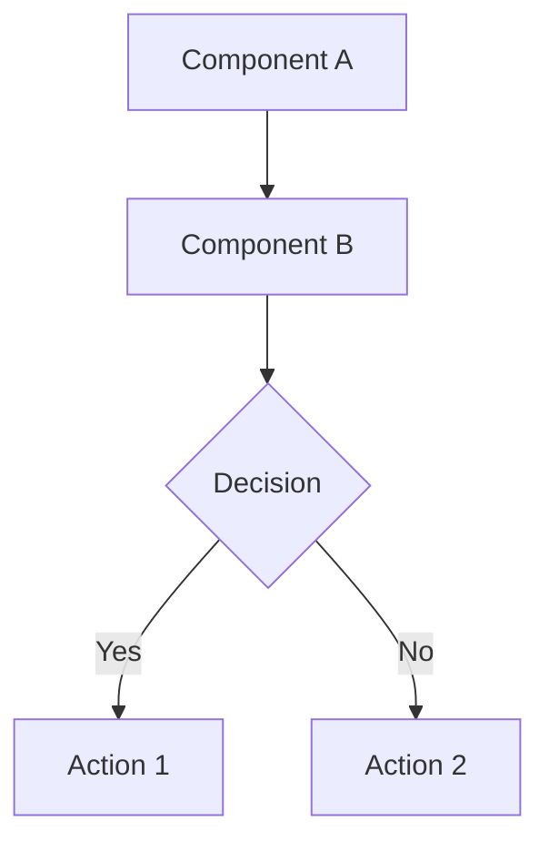

## System / Process Docs

**Location:** `documentation/Docs/[Process-Name].md`

These documents explain how systems and workflows work — not individual files. Focus on how multiple components work together.

### Template

```markdown
## Table of Contents
1. [Overview](#overview)
2. [Key Entities](#key-entities)
3. [Architecture](#architecture)
4. [Process Flow](#process-flow)
5. [Technical Implementation Details](#technical-implementation-details)
6. [Related Files](#related-files)

---

## Overview

[High-level explanation in plain language — avoid jargon]

### Core Concepts
[Key concepts explained simply]

---

## Key Entities

### 1. [EntityName]
[Description with link to code explanation: [[EntityName-ext]]]

---

## [System Name] Architecture

[Detailed architecture explanation]

### Diagram



---

## [Process Name] Flow

### Step 1: [Step Name]
**Location:** [[FileName-ext]] — `src/path/to/File.ext:42`
[What happens here]

---

## Technical Implementation Details
[Deep-dive into technical aspects that need explanation]

---

## Related Files

### Controllers
- [[ControllerFile-ext]] — [description]

### Services
- [[ServiceFile-ext]] — [description]

### Models / Entities
- [[ModelFile-ext]] — [description]
```

### Requirements
- Use Mermaid.js for all complex flows and interactions
- Link to all related `Code/` explanation files
- Reference source code as plain text paths with line numbers
- Don't describe how a single code file works — that belongs in `Code/`
- Focus on how the system works as a whole
