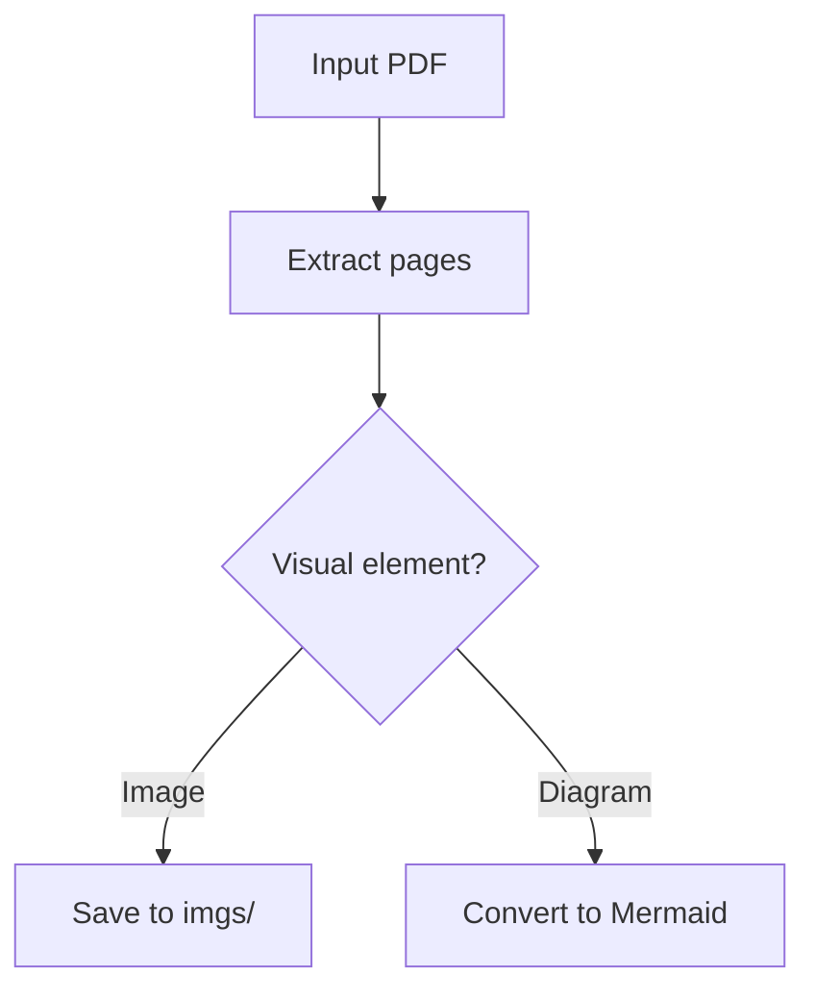

# PDF To Markdown Converter

Convert PDFs to Markdown as a faithful format transformation, not as a summary.
The output must preserve enough structure that quotes can later be traced back
to the original PDF page.

## Core Contract

Given one or more PDF files:

- If there is exactly one PDF and the conversion emits no extracted image files,
  produce exactly one `.md` file.
- If there is more than one PDF, produce one `.md` file per PDF and package them
  together in a `.zip` file.
- If any image file is emitted, produce a `.zip` file even when there is only one
  PDF. Put the Markdown file or files at the zip root and put all images in a
  shared `imgs/` directory.
- Diagrams are not delivered as images. Convert diagrams to Mermaid.js blocks in
  the Markdown at the diagram location.
- Do not omit pages. Every original PDF page must have an explicit page marker in
  the Markdown.

## Output Layout

For one PDF without extracted images:

```text
document-name.md
```

For one PDF with extracted images:

```text
document-name.zip
+-- document-name.md
+-- imgs/
    +-- document-name-p001-img01.png
    +-- document-name-p004-img02.jpg
```

For multiple PDFs:

```text
converted-pdfs.zip
+-- first-document.md
+-- second-document.md
+-- imgs/
    +-- first-document-p002-img01.png
    +-- second-document-p009-img01.jpg
```

Only include `imgs/` when there are extracted non-diagram images. Use stable,
collision-resistant image names: `<pdf-slug>-pNNN-imgNN.<ext>`.

## Markdown File Format

Every Markdown file begins with YAML frontmatter:

```markdown
---
name: "Document Name"
description: "Brief one-sentence description of what the document is about."
---

## Document page 1

...

## Document page 2

...
```

Use this exact page marker pattern:

```markdown
## Document page X
```

Where `X` is the original PDF page number in reading order. Page 1 starts after
the YAML frontmatter. If a page is blank, still include the page marker and write
`[Blank page]` below it.

## Workflow

1. Identify all input PDFs and the desired output location. If the user does not
   specify an output location, write the output beside the input file for a
   single PDF or beside the first input file for a batch.
2. Inspect each PDF page by page. Determine whether it has selectable text,
   scanned text requiring OCR, tables, images, diagrams, footnotes, or reference
   sections.
3. Extract or OCR text per page. Keep page boundaries separate throughout the
   conversion so text cannot drift between pages.
4. Detect the document name from the document content. Prefer the title page,
   cover page, prominent first-page heading, or running title. If no reliable
   document name is visible, use the PDF file name without the extension.
5. Write a brief `description` in the YAML frontmatter. Keep it short, factual,
   and specific enough to identify the document's purpose.
6. Convert each page to Markdown in original reading order. Preserve headings,
   paragraphs, lists, visible page text, footnotes, citations, quotes, and
   reference entries as faithfully as possible.
7. Convert tables to Markdown tables. Pay special attention to line breaks,
   `<br>` tags, pipes, and multi-line cells.
8. Extract non-diagram images, save them in `imgs/`, and insert Markdown image
   links at the location where the image appears in the PDF.
9. Convert all diagrams to Mermaid.js instead of linking to image files.
10. Package the results according to the output contract.
11. Validate the output before reporting completion.

## Images

Treat photos, screenshots, illustrations, figures, logos, and other non-diagram
visual assets as images.

- Save extracted images in `imgs/`.
- Insert a Markdown image link where the image appears:

```markdown

```

- Use descriptive alt text when the image meaning is clear. Use neutral alt text
  such as `Image from page 3` when the image cannot be described reliably.
- Keep image links relative to the Markdown file.
- Do not place images in per-document directories when processing multiple PDFs.
  Use one shared `imgs/` directory at the zip root.
- If an image is purely a diagram, do not include it as an image in the final
  output. Convert it to Mermaid.js instead.

## Diagrams

Diagrams must be represented as Mermaid.js, even when the source diagram is an
embedded image in the PDF.

- Place the Mermaid block where the diagram appears in the original page.
- Choose the Mermaid diagram type that best matches the source: `flowchart`,
  `sequenceDiagram`, `classDiagram`, `stateDiagram`, `erDiagram`, `journey`, or
  another valid Mermaid type.
- Preserve labels, arrows, relationships, direction, and grouping as closely as
  possible.
- Do not invent missing labels or relationships. If text is unreadable, mark it
  as `[illegible]` rather than guessing.
- If the source diagram is too visually complex for exact Mermaid conversion,
  produce the closest faithful Mermaid representation and preserve all readable
  text and relationships.

Example:

````markdown

````

## Tables

Convert PDF tables to Markdown tables, not screenshots.

- Preserve the original row and column order.
- Preserve header rows when present.
- Escape literal pipe characters inside cells as `\|`.
- Convert real line breaks inside a cell to `<br>` so they do not split the row.
- Preserve existing `<br>` tags as inline cell breaks; do not let them create new
  table rows.
- Keep citations, symbols, units, superscripts, and footnote markers inside their
  cells.
- For merged cells, repeat the merged label in the affected columns or use the
  closest plain Markdown representation that does not misstate the data.

## Quotes, Citations, Footnotes, And References

Most source documents are academic or paper-like, so citation fidelity matters.

- Preserve the document's original citation style. Do not normalize APA, MLA,
  IEEE, Chicago, or other styles.
- Preserve quoted text exactly, including quotation marks, block quote structure,
  indentation, punctuation, and citation markers.
- Keep footnotes at the bottom of the page where they appear in the PDF.
- Keep reference sections where they appear in the original document. If the PDF
  puts all references on one page, keep them on that page.
- Do not move references to a global bibliography unless the PDF itself does so.
- Do not paraphrase academic prose during conversion.

## OCR And Extraction Quality

Use the best available local tooling for the PDF shape:

- Use text extraction for selectable-text PDFs.
- Use OCR for scanned pages or pages where extraction produces garbled text.
- Use layout-aware extraction when columns, tables, or footnotes would otherwise
  be reordered incorrectly.
- Inspect problematic pages visually when possible.
- If the required conversion cannot be completed because image extraction, OCR,
  or diagram reading is unavailable, report the blocker instead of fabricating
  content.

## Validation Checklist

Before returning the result:

- Confirm each Markdown file has YAML frontmatter with `name` and `description`.
- Confirm every PDF page has a `## Document page X` marker in order.
- Confirm tables render as Markdown tables and cell line breaks do not break row
  structure.
- Confirm every non-diagram extracted image has a file in `imgs/` and a matching
  Markdown image link.
- Confirm every diagram is represented as a Mermaid.js block, not as an image.
- Confirm quotes, citations, footnotes, and references were preserved in their
  original page locations.
- Confirm the packaging rule is correct: single `.md` only for one PDF with no
  extracted images; `.zip` for multiple PDFs or any extracted images.
- For zip outputs, verify the archive contains Markdown files at the root and a
  shared `imgs/` directory when images are present.

## Final Response

When the conversion is complete, report the output file path or archive path.
Mention any pages where OCR, unreadable text, complex diagrams, or table
structure required approximation.
